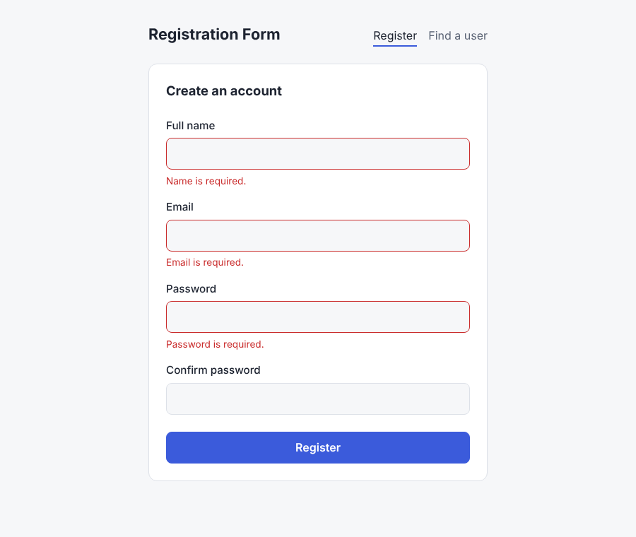
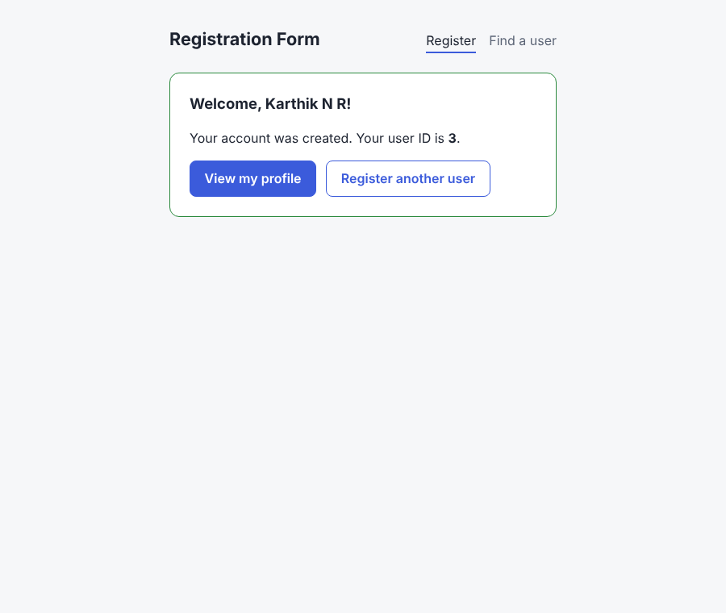
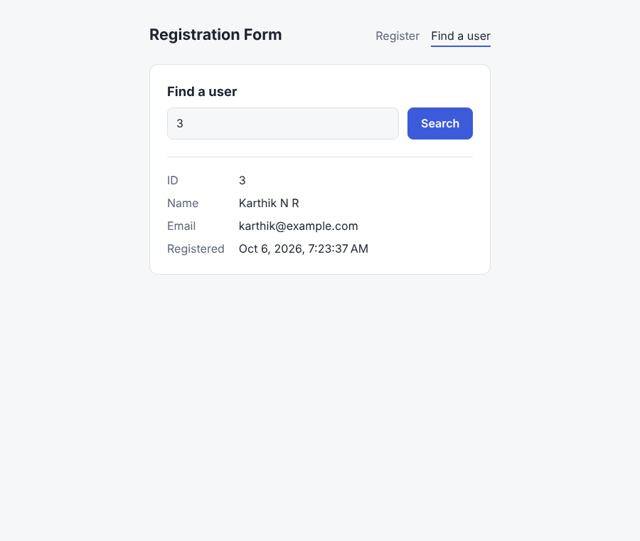

# Registration Form

[](https://github.com/imkarthiknr/registration-form/actions/workflows/ci.yml)


A small full-stack user registration app. It has an **Angular** single-page client with a validated sign-up form and user lookup, backed by an **Express** REST API that hashes passwords and never sends them back to the client.

The project started in 2020 as a college exercise in Angular's `HttpClient`. In 2026 it was rebuilt into a tested, documented monorepo. [CHANGELOG.md](CHANGELOG.md) has the full history.

| Register (validation)                                 | Registered                                              | Find a user                                 |
| ----------------------------------------------------- | ------------------------------------------------------- | ------------------------------------------- |
|  |  |  |

## Features

- **Registration form** built with Angular reactive forms. It validates required fields, email format, password strength (8+ characters with a letter and a number) and password confirmation.
- **Server-side validation** mirrors the client rules. Per-field errors from the API (such as a duplicate email) appear inline on the matching form field.
- **User lookup by ID**. The ID is kept in the URL (`/lookup?id=3`), so results can be shared and the back button works.
- **Secure by default**. Passwords are hashed with salted `scrypt`, the hash never leaves the server, and a request body size limit is enforced.
- **Modern Angular**: standalone components, signals, zoneless change detection, lazy-loaded routes, and the new control flow (`@if`).
- Accessible markup (labels, `aria-invalid`, live regions) and automatic light/dark theming.
- **Tested and CI'd**. Vitest covers the client, `node:test` with Supertest covers the API, and GitHub Actions runs everything on each push.

## Tech stack

| Layer    | Technology                                                 |
| -------- | ---------------------------------------------------------- |
| Frontend | Angular 21, TypeScript 5.9, RxJS, Reactive Forms, Vitest   |
| Backend  | Node.js, Express 5, `node:crypto` (scrypt), `node:test`, Supertest |
| Tooling  | npm, Prettier, GitHub Actions                              |

## Quick start

You need **Node.js 20.19+, 22.12+ or 24+** and npm.

```bash
git clone https://github.com/imkarthiknr/registration-form.git
cd registration-form
npm install        # root tooling (concurrently)
npm run setup      # installs backend + frontend dependencies
npm run dev        # API on :3000, web app on :4200
```

Then open <http://localhost:4200>. The API starts with two demo users (IDs **1** and **2**), so the lookup page works right away.

## Project structure

```
registration-form/
├── backend/                 Express REST API
│   ├── src/
│   │   ├── app.js           App factory: routes, JSON parsing, error handling
│   │   ├── server.js        Entry point: config, demo seed data, listen
│   │   ├── user-store.js    In-memory repository (swappable for a database)
│   │   ├── validation.js    Request validation rules
│   │   └── password.js      scrypt hashing / verification
│   └── test/                node:test + Supertest suites
├── frontend/                Angular client
│   ├── src/app/
│   │   ├── core/            Models, UserService, HTTP error mapping
│   │   ├── features/
│   │   │   ├── register/    Registration form
│   │   │   └── lookup/      Find user by ID
│   │   ├── shared/validators/  Reusable form validators
│   │   └── app.*            Shell, routes, providers
│   └── proxy.conf.json      Dev proxy: /api → http://localhost:3000
├── docs/                    API reference, screenshots
├── .github/workflows/ci.yml
├── DEVELOPMENT.md           Developer guide
└── CONTRIBUTING.md
```

## API at a glance

| Method | Endpoint          | Description                          |
| ------ | ----------------- | ------------------------------------ |
| `GET`  | `/api/health`     | Liveness check                       |
| `POST` | `/api/users`      | Register a user → `201` with profile |
| `GET`  | `/api/users/:id`  | Get a user's public profile          |
| `GET`  | `/api/users`      | List users                           |

The full request and response reference is in [docs/API.md](docs/API.md).

## Scripts

Run these from the repository root:

| Command                | What it does                                   |
| ---------------------- | ---------------------------------------------- |
| `npm run setup`        | Install backend and frontend dependencies      |
| `npm run dev`          | Run API and web app together with live reload  |
| `npm test`             | Run all backend and frontend tests             |
| `npm run build`        | Production build of the frontend → `frontend/dist/` |
| `npm run format:check` | Check frontend formatting with Prettier        |

Per-package commands, configuration and debugging tips are in [DEVELOPMENT.md](DEVELOPMENT.md).

## Limitations

This is a learning and portfolio project, not a production identity system:

- Users are stored **in memory** and are lost when the API restarts.
- There is no authentication or session. Any user's public profile can be looked up by ID.
- There is no rate limiting or CAPTCHA on registration.

The roadmap in [DEVELOPMENT.md](DEVELOPMENT.md#roadmap) covers these.

## Contributing

Issues and pull requests are welcome. Please read [CONTRIBUTING.md](CONTRIBUTING.md) first.

## License

[MIT](LICENSE) © Karthik N R
